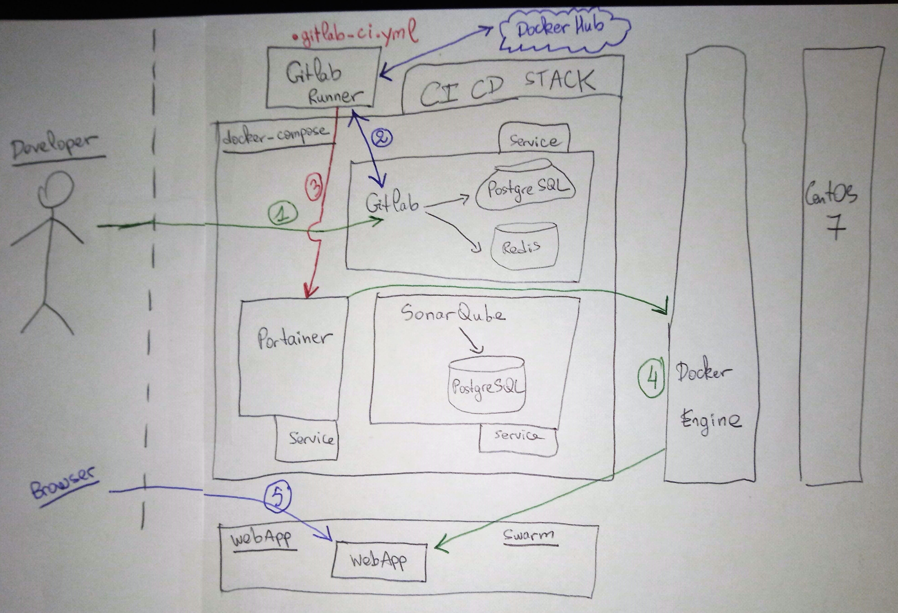

# CI-CD Pipeline Solution Overview


(1) The developer makes changes in the web application then pushes those changes to master

(2) Gitlab communicates with the gitlab-runner that performes the actions defined in .gitlab-ci.yml, in the example : 
- Static analysis with SonarQube
- Test with npm test
- build and push the image to docker hub: https://cloud.docker.com/repository/docker/anaselhajjaji/nodejsapp
- Deploy the the new image to docker

(3) The gitlab-runner invoke the webhook defined in Portainer (Service section, don't forget to copy the URL to Gitlab CI variables)

(4) Once the webhook received, Portainer deploys the new version of the service (downloads the latest image from the docker hub then deploys it). Portainer communicate with the docker engine to do so

(5) The new version of the webapp is available for the browser

# Implementation
## CI CD Stack
docker-compose is used for this stack:
```
docker-compose up -d
```
## Gitlab Runner Configuration
The file .gitlab-ci.yml should be present in gitlab repository root.

The command to register the runner :

```
docker run --rm -t -i -v $CONFIG_PATH:/etc/gitlab-runner --name gitlab-runner gitlab/gitlab-runner:latest register --non-interactive --executor "docker" --docker-image alpine:3 --url "http://192.168.43.41:8080/ci" --registration-token "EpHZLFMH-pcyV7ivR6Xm" --description "docker-runner" --tag-list "docker,aws" --run-untagged --locked="false"
```

Then start the runner :

```
docker run -d --name gitlab-runner --restart always -v $CONFIG_PATH:/etc/gitlab-runner -v /var/run/docker.sock:/var/run/docker.sock gitlab/gitlab-runner:latest
```

To publish to docker hub, set the following variables :

```
CI_REGISTRY_USER=username
CI_REGISTRY_PASSWORD=********
CI_REGISTRY=docker.io
SONAR_TOKEN=token_generated_in_sonarqube
```

Docker host should be exposed, on centos 7:

Create the file : /etc/systemd/system/docker.service.d/docker-external.conf
With content :
```
[Service]
ExecStart=
ExecStart=/usr/bin/dockerd -H tcp://0.0.0.0:2375 -H unix:///var/run/docker.sock
```

Then restart docker:
```
systemctl daemon-reload
systemctl restart docker
```
## WebApp Installation
To deploy the webapp in swarm:
```
docker stack deploy -c webapp.yml webapp
```
